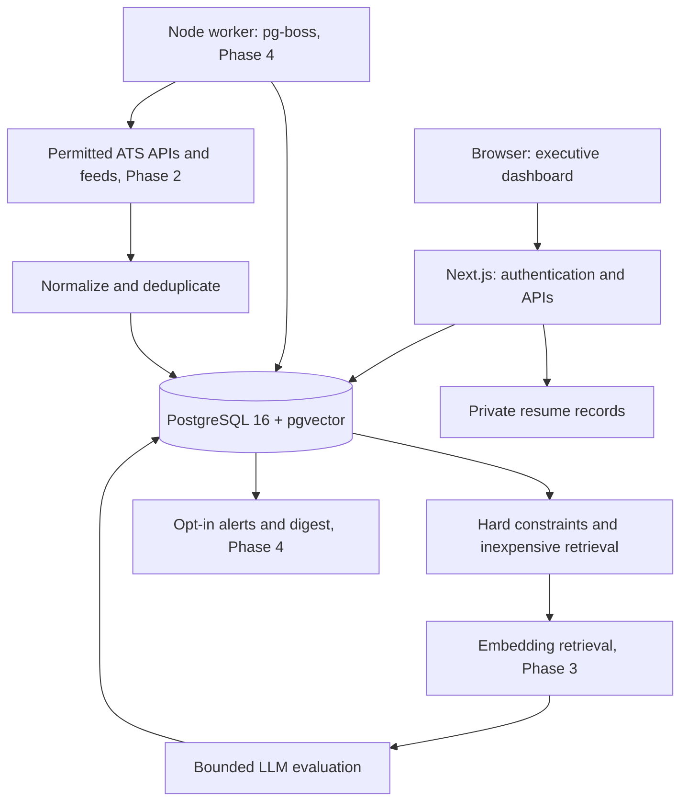

# JobFinder AI — architecture and delivery plan

Status: Phase 1 + Phase 2 implementation. The requirements document remains the product specification. This design deliberately leaves AI matching and automation to their specified phases; an empty database must never imply invented job listings or AI scores.

## Architecture

Use a TypeScript workspace with Next.js App Router for UI and authenticated HTTP APIs, Drizzle for PostgreSQL 16, and pgvector for Phase 3 embeddings. A separate Node worker will use pg-boss in Phase 4: durable jobs, retries, and scheduling in the database we already operate, without adding Redis. Keep provider, matching, and shared contracts independent of Next.js. Use Docker Compose for local deployment; defer AWS infrastructure.

### Repository boundaries

- `apps/web`: Next.js pages, route handlers, server-only auth and application services, reusable UI.
- `packages/db`: typed schema, versioned SQL migrations, database connection and migration command.
- `packages/shared`: Zod input schemas, profile/preferences and job contracts.
- `packages/job-sources`: source connector contract; concrete adapters arrive in Phase 2.
- `packages/matching`: deterministic weight validation and score aggregation; semantic evaluation arrives in Phase 3.
- `apps/worker` and `packages/ai`: reserved for the actual worker and AI implementation, not empty running services.
- `tests`: unit and real PostgreSQL/API/E2E verification. `doc`: decisions and plans.

## PostgreSQL schema

Use UUID primary keys and timezone-aware timestamps. Private records always carry a user foreign key. Every private read and write must scope by authenticated user; public job records can be shared. Prefer typed JSONB for evolving structured profile/preferences, while keeping searchable jobs relational.

| Table              | Important columns and constraints                                                                                               |
| ------------------ | ------------------------------------------------------------------------------------------------------------------------------- |
| users              | unique normalized email, password hash, name, role, created_at                                                                  |
| sessions           | SHA-256 token hash PK, user_id FK, expiry; raw tokens only in HTTP-only cookies                                                 |
| rate_limits        | hashed bucket key PK, count, expiry; atomic update shared across instances                                                      |
| user_profiles      | user_id PK/FK, typed structured profile JSONB, updated_at                                                                       |
| career_preferences | user_id PK/FK, typed preferences JSONB, updated_at                                                                              |
| resumes            | id, user_id, filename, MIME, original bytes encoded privately, extracted text, created_at                                       |
| companies          | id, name, domain, optional industry/size/overview                                                                               |
| job_sources        | id, provider, unique provider/board identity, enabled, source URL                                                               |
| jobs               | id, company_id, title, description, employment/seniority/location, compensation, canonical URL/hash, lifecycle dates and status |
| job_references     | job_id + source_id + external_id; retain all provenance for deduplicated listings                                               |
| job_matches        | user_id + job_id PK, qualification/interest/overall scores, confidence, versioned explanation JSONB, evaluated_at               |
| saved_jobs         | user_id + job_id PK, action/status, notes, updated_at                                                                           |
| job_status_history | id, user_id, job_id, action, created_at; append on every user action                                                            |
| audit_events       | id, user_id, action, created_at; exclude sensitive payloads                                                                     |

Later migrations add separate job_locations/job_skills indexes when filtering volume warrants them, job_embeddings with model/dimension/version, company_watchlists, search_runs, notifications and detailed applications. Roles/skills and their priorities initially live in validated preferences JSONB. Profile data is stored separately from original resume content. Originals remain in private PostgreSQL storage for the local MVP; production moves them to encrypted object storage with short-lived authorized downloads and retention/deletion controls.

## API architecture

JSON errors use `{ error: string }` with meaningful HTTP status codes. Never return a password hash, session token, database error, or another user's resume. All mutations require a matching configured Origin (CSRF protection). Session expiry and authorization are checked in the data layer, not just page navigation.

| Endpoint                                 | Phase 1 behavior                                                        |
| ---------------------------------------- | ----------------------------------------------------------------------- |
| POST /api/auth/register, /login, /logout | local email/password account, opaque DB session, rate limited           |
| GET/PUT /api/profile                     | read/update validated private structured profile                        |
| GET/PUT /api/preferences                 | targets, weighted role groups, skills, hard filters and ranking weights |
| GET/POST /api/resumes                    | metadata listing and bounded TXT/PDF/DOCX text extraction               |
| GET/DELETE /api/resumes/:id              | owner-only original download and deletion                               |
| GET /api/jobs                            | paginated query, location/work arrangement and saved-state filters      |
| GET /api/jobs/:id                        | normalized listing and current user's evaluation/status                 |
| PUT /api/jobs/:id/status                 | save/ignore/application status, transactional history                   |
| GET /api/health                          | database readiness without connection details                           |

Searches, companies/watchlists, notifications, and matching APIs arrive with their actual services. No endpoints that silently succeed without doing work.

## Connector contract and source policy

`SourceConnector` exposes `search(query, cursor, signal)`, `fetchJob(reference, signal)`, and `normalize(raw)`. Search returns a validated page plus continuation and conditional-fetch metadata. Board identity is configuration, never an arbitrary fetch URL. Normalized jobs retain provider, external ID, original URL, timestamps and unknown values explicitly. Phase 2 uses Greenhouse, Lever and Ashby board APIs, RemoteOK's permitted feed, and allowlisted JSON-LD pages.

Maintain a provider registry with approved hosts, API/access documentation, request budget, and disable switch. Respect terms, robots and rate limits; no CAPTCHA/authentication bypass. Honor Retry-After, cache ETags/Last-Modified, time out fetches, cap bytes and pages, prevent private-IP/redirect SSRF, and use deterministic fixture tests. Fetch failures must not mark all jobs removed; lifecycle updates require a successful complete scan. Prefer original ATS provenance. Ashby may need jobUrl-derived identity because its documented public payload has no guaranteed ID.

## Matching design

1. Evaluate explicit hard constraints first (country/work authorization, work type, employment, seniority, excluded companies/skills). Failed constraints are placed outside the normal ranked list; unknown constraints are visibly unresolved.
2. Cheap lexical retrieval and configurable negative signals narrow the candidate set. These are retrieval signals, never presented as semantic AI evaluation.
3. Embed job content and the minimal relevant structured profile; version/cache by content hash and model. Retrieve candidates using cosine similarity and pgvector.
4. Evaluate the top bounded set with structured LLM output for role (20), experience (20), skills (15), leadership (15), industry (10), location (10), compensation (5), career direction (5). Each factor is 0–1 with evidence and uncertainty. Validate schema, reject out-of-range scores, and never let model output override hard constraints.
5. Aggregate weighted factors to a 0–100 overall score; qualification normalizes experience/skills/leadership, interest normalizes role/industry/location/compensation/career direction. A user-configured total must equal 100. Missing salary has neutral fit and reduced confidence; do not infer currency conversions without a dated rate.
6. Return evidence, gaps, transferable skills, progression category, and confidence based on data completeness. Store weights/model/prompt/profile versions for reproducibility. Explicit preferences dominate later learned signals.

LLMs are for structured resume suggestions (user-reviewed), title expansion, semantic reasoning, progression explanation and digest prose. Parsing, access control, normalization, deduplication keys, filters, aggregation, scheduling and alert thresholds remain deterministic. Retrieved content is data separated from instructions; the evaluator has no tools, credentials, or authority to submit applications. Only minimal profile fields leave the server. Phase 1 extracts text locally and leaves profile editing in the user's control.

## Authentication and privacy boundary

Use Node's scrypt with a random salt and OWASP work factors, random 256-bit session tokens, SHA-256 token storage, HTTP-only SameSite=Lax cookies and Secure cookies on HTTPS. Enforce configured application Origin on writes, database-backed login/registration/upload limits and owner-scoped data access. The default Compose stack binds to loopback. This is a local foundation, not a production launch: verified email/recovery, external identity provider or MFA, deployment-level throttling, HTTPS, least-privilege DB credentials, managed encryption/backups, retention/export and a security review are production prerequisites.

Resume uploads: maximum 5 MiB, permitted signatures/extensions, bounded text extraction, original separate from profile, no HTML rendering. Reject scanned PDFs without extractable text with a helpful message. Do not promise OCR or AI extraction in Phase 1. Seed only an explicitly requested fictional profile; never install a shared demo password or fabricate live opportunities.

## MVP cost assumptions

Phase 1 local Compose has no cloud or API charges, excluding the host computer. Budget assumption for a later small single-host deployment: USD 15–40/month for compute/storage/backups; this is an estimate, not a vendor quote. Managed AWS services, redundant databases and NAT gateways can materially exceed it. Phase 3 should have per-run job/token caps and a user-configured monthly budget; calculate AI charges from recorded tokens and selected model prices. No paid search or notification provider is required for Phase 1. See documentation discovery below for verified API pricing when enabling AI.

For Phase 3, a configurable starting point is GPT-5.4 mini for structured explanations and text-embedding-3-small for retrieval, subject to account access and evaluation. Documentation checked during design lists USD 0.75 per million input tokens and 4.50 per million output tokens for [GPT-5.4 mini](https://developers.openai.com/api/docs/models/gpt-5.4-mini), and USD 0.02 per million embedding tokens for [text-embedding-3-small](https://developers.openai.com/api/docs/models/text-embedding-3-small). An illustrative monthly workload of 3,000 explanations at 2,000 input/300 output tokens each costs USD 8.55, plus USD 0.06 for 3 million embedding tokens, before retries or other processing. Allocate USD 25/month initially with a hard application budget; verify prices again before enabling billing-dependent work. No model or key is wired into Phase 1.

## Phased implementation and verification

### Phase 0 — documentation discovery

Read actual APIs before implementation: [Next.js cookies](https://nextjs.org/docs/app/api-reference/functions/cookies), [route handlers](https://nextjs.org/docs/app/api-reference/file-conventions/route), [Drizzle PostgreSQL](https://orm.drizzle.team/docs/get-started-postgresql), [migrations](https://orm.drizzle.team/docs/migrations), [Node crypto](https://nodejs.org/api/crypto.html), [OWASP password storage](https://cheatsheetseries.owasp.org/cheatsheets/Password_Storage_Cheat_Sheet.html), [pg-boss](https://github.com/timgit/pg-boss), [unpdf text extraction](https://github.com/unjs/unpdf#extract-text-from-pdf), and [Mammoth raw text](https://github.com/mwilliamson/mammoth.js#basic-conversion).

Allowed patterns: await Next cookies and dynamic params; parameterized Drizzle queries and versioned SQL; async scrypt; unpdf `getDocumentProxy`/`extractText`; Mammoth `extractRawText`. Avoid synchronous request-path hashing, rendering document HTML, using sync cookies, or exposing DB credentials to the client.

### Phase 1 — foundation (complete)

Implement the workspace, database migration, real authentication, private profile/preferences forms, TXT/PDF/DOCX upload/download/delete, responsive light/dark dashboard with filters and genuine empty states, job detail and persistent user status. Copy the documented APIs above. Verify lint, strict typecheck, build, deterministic unit tests, real-DB integration tests, and Playwright account/profile/upload/authorization flows. Compose must start without credentials for external services. Do not claim matching/discovery is running.

### Phase 2 — discovery (current)

Implemented connectors for the official Greenhouse and Lever APIs, Ashby's public posting API, RemoteOK's permitted feed, and allowlisted JSON-LD `JobPosting` pages. The transport is HTTPS-only, fixed-host, redirect-rejecting, DNS-pinned, size/time bounded, and rejects non-public addresses. Provider payloads are Zod-validated and normalized without inventing missing values; HTML becomes bounded text. User-triggered complete scans upsert canonical jobs, retain provider/external-ID provenance, update changed descriptions, isolate per-job failures, and mark disappearances only after a complete scan. Resumable scheduling remains in Phase 4.

### Phase 3 — matching

Implement versioned embeddings, pgvector retrieval and validated explanations using [OpenAI embeddings](https://developers.openai.com/api/docs/guides/embeddings) and [Structured Outputs](https://developers.openai.com/api/docs/guides/structured-outputs). Verify hard-filter precedence, deduplication, aliases, missing compensation, weight changes, injection fixtures and token caps; run approved live smoke tests only after secure key creation. Never invent scores when AI is unavailable.

### Phase 4 — automation

Use pg-boss documented queue creation, send/work and scheduling APIs for resumable searches, watchlists, opt-in notification delivery and diagnostics. Verify crash/retry idempotency, source timeouts, no duplicate notifications and successful full scans before removal. No unsolicited outbound messages during setup.

### Phase 5 — advanced discovery

Add providers only where access permits, using official docs and sanitized fixtures per source. Verify SSRF/robots/redirect policy and isolate any browser worker. Do not treat publicly reachable as permission to crawl.

### Phase 6 — application intelligence

Expand status tracking to contacts/interviews/follow-ups and user-reviewed writing assistance. Verify all data is user-scoped and explicit preferences dominate feedback. Applications are never submitted automatically.

### Final verification before production

Reconcile implementation with this plan and current official APIs, exercise failure paths, scan dependencies, build containers, run E2E on a clean database, review secrets/retention and complete the production authentication/privacy prerequisites. CI deployment is intentionally deferred until a target environment is approved and configured.
